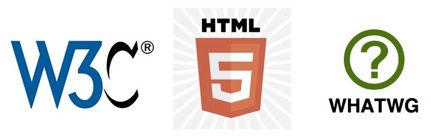
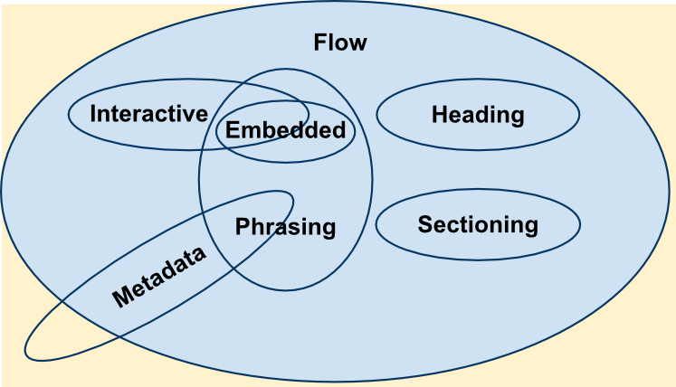

#HSLIDE

### HTML/CSS, часть 1


Сергей Денисов

Старший фронтенд-разработчик


06.02.2017

#HSLIDE

### HTML5

* Последняя версия языка гипертекстовой разметки —
[HyperText Markup Language (HTML)](https://developer.mozilla.org/en-US/docs/Web/HTML), который используется для создания
и визуального представления веб-страниц.

* [Набор технологий (APIs)](https://developer.mozilla.org/en-US/docs/Web), позволяющих создавать разнообразные сайты и
Web-приложения: [Audio](https://developer.mozilla.org/en-US/docs/Web/API/Web_Audio_API),
[Video](https://developer.mozilla.org/en-US/docs/Learn/HTML/Multimedia_and_embedding/Video_and_audio_content),
[Drag and Drop](https://developer.mozilla.org/en-US/docs/Web/API/HTML_Drag_and_Drop_API) и т.д.

#HSLIDE

### [WC3/WHATWG](http://edgeatx.github.io/slides/2015/03-mar/#slide-18)



#VSLIDE

* [Консорциум Всемирной паутины (W3C)](https://ru.wikipedia.org/wiki/%D0%9A%D0%BE%D0%BD%D1%81%D0%BE%D1%80%D1%86%D0%B8%D1%83%D0%BC_%D0%92%D1%81%D0%B5%D0%BC%D0%B8%D1%80%D0%BD%D0%BE%D0%B9_%D0%BF%D0%B0%D1%83%D1%82%D0%B8%D0%BD%D1%8B)
(World Wide Web Consortium) — организация, разрабатывающая и внедряющая стандарты для
Всемирной паутины. Консорциум возглавляет сэр Тимоти Джон Бернерс-Ли.

* [WHATWG](https://ru.wikipedia.org/wiki/WHATWG) (Web Hypertext Application Technology Working Group) — сообщество
людей, заинтересованных в развитии Интернета. Оно было основано в 2004 году производителями
браузеров: Apple, Mozilla Foundation и Opera Software.

#HSLIDE

### HTML: [Doctype](https://developer.mozilla.org/en-US/docs/Glossary/doctype)

* HTML 4:

```html
<!DOCTYPE HTML PUBLIC "-//W3C//DTD HTML 4.01//EN"
          "http://www.w3.org/TR/html4/strict.dtd">
```

* HTML 5:

```html
<!DOCTYPE html>
```

#HSLIDE

### HTML: [элементы](https://developer.mozilla.org/en-US/docs/Learn/HTML/Introduction_to_HTML/Getting_started#Anatomy_of_an_HTML_element) и [атрибуты](https://developer.mozilla.org/en-US/docs/Learn/HTML/Introduction_to_HTML/Getting_started#Attributes)


#VSLIDE

Элемент может быть:

* Быть пустым:

```html
<input type="button"/>
```

* Содержать другие элементы:

```html
<ul>
    <li>Element 1</li>
    <li>Element 2</li>
    ...
</ul>
```

#VSLIDE

* [Валидные элементы](https://developer.mozilla.org/en-US/docs/Web/HTML/Element).

* [Валидные атрибуты](https://developer.mozilla.org/en-US/docs/Web/HTML/Attributes).

#HSLIDE

### HTML: [категории контента](https://developer.mozilla.org/en-US/docs/Web/Guide/HTML/Content_categories)



+[Basic element (root)](https://developer.mozilla.org/en-US/docs/Web/HTML/Element#Basic_elements): `<html>`

#VSLIDE

### [Flow content](https://developer.mozilla.org/en-US/docs/Web/Guide/HTML/Content_categories#Flow_content)

```html
<div>, <header>, <main>, <footer>, <ol>, <p>, <table>, <ul>
```

[Пример](https://jsfiddle.net/sergdenisov/v82gyp69/):

```html
<div>Text</div>
<p>Paragraph with content</p>
<ul>
    <li>Item 1</li>
    <li>Item 2</li>
    <li>Item 3</li>
</ul>
```

#VSLIDE

### [Phrasing content](https://developer.mozilla.org/en-US/docs/Web/Guide/HTML/Content_categories#Phrasing_content)

```html
<b>, <em>, <i>, <span>, <strong>, <sub>, <sup>
```

[Пример](https://jsfiddle.net/sergdenisov/kLttvwat/):

```html
<b>Bold text</b>
<em>Emphasis text</em>
<span>Simple text</span>
```

#VSLIDE

### [Metadata content](https://developer.mozilla.org/en-US/docs/Web/Guide/HTML/Content_categories#Metadata_content)

```html
<meta>, <script>, <style>, <title>
```

Пример:

```html
<meta charset="utf-8"/>
<title>Awesome page title</title>
<script src="javascript.js"></script>
```

#VSLIDE

### [Sectioning content](https://developer.mozilla.org/en-US/docs/Web/Guide/HTML/Content_categories#Sectioning_content)

```html
<article>, <aside>, <nav>, <section>
```

[Пример](https://jsfiddle.net/sergdenisov/mk1ttLd6/1/):

```html
<article>
    <p>
        The Disney movie <em>The Little Mermaid</em> was
        first released to theatres in 1989.
    </p>
    <aside>
        <p>
            The movie earned $87 million during its initial
            release.
        </p>
    </aside>
    <p>More info about the movie...</p>
</article>
```

#VSLIDE

### [Heading content](https://developer.mozilla.org/en-US/docs/Web/Guide/HTML/Content_categories#Heading_content)

```html
<h1>, <h2>, <h3>, <h4>, <h5>, <h6>
```

[Пример](https://jsfiddle.net/sergdenisov/eymartn0/):

```html
<h1>Main title</h1>
<h2>Second title</h2>
<h3>Third title</h3>
<h4>Fourth title</h4>
<h5>Fifth title</h5>
<h6>Sixth title</h6>
```

#VSLIDE

### [Embedded content](https://developer.mozilla.org/en-US/docs/Web/Guide/HTML/Content_categories#Embedded_content)

```html
<audio>, <canvas>, <iframe>, , <svg>, <video>
```

[Пример](https://jsfiddle.net/sergdenisov/da5yxs2u/):

```html

<iframe width="560" height="315"
        src="https://www.youtube.com/embed/wn1Cvo43ri8"
        frameborder="0" allowfullscreen>
</iframe>
```

#VSLIDE

### [Interactive content](https://developer.mozilla.org/en-US/docs/Web/Guide/HTML/Content_categories#Interactive_content)

```html
<a>, <button>, <label>, <select>, <textarea>
```

[Пример](https://jsfiddle.net/sergdenisov/40pdozdb/):

```html
<a href="https://hh.ru">HeadHunter link</a>
<label>
    Choose:
    <select>
        <option value="1">One</option>
        <option value="2">Two</option>
    </select>
</label>
```

#VSLIDE

### [Form-associated content](https://developer.mozilla.org/en-US/docs/Web/Guide/HTML/Content_categories#Form-associated_content)

```html
<button>, <fieldset>, <input>, <label>, <select>, <textarea>
```

Пример:

```html
<form action="https://hh.ru/search/vacancy" method="get">
    <label>Vacancy name:
        <input type="text" name="text"/>
    </label>
    <input type="hidden" name="area" value="1"/>
    <button type="submit">Search</button>
</form>
```

#HSLIDE

### HTML: [типы атрибутов](https://developer.mozilla.org/en-US/docs/Web/HTML/Attributes)

* [Глобальные](https://developer.mozilla.org/en/docs/Web/HTML/Global_attributes) — применимы к любому элементу.

```
id, class, contenteditable, data-*
```

* [Обязательные для определенного элемента](https://developer.mozilla.org/en/docs/Web/HTML/Element/a#attr-href).

```html
<a href="https://www.google.ru">Search</a> 
```

* [Опциональные для определенного элемента](https://developer.mozilla.org/en/docs/Web/HTML/Element/button#attr-type).

```html
<button type="button">Click me</button>
```

#HSLIDE

### HTML: [комментарии](https://developer.mozilla.org/en-US/docs/Learn/HTML/Introduction_to_HTML/Getting_started#HTML_comments) и [специальные символы (entities)](https://developer.mozilla.org/en-US/docs/Glossary/Entity)

```html
&nbsp; <!-- неразрывный пробел -->

&quot; <!-- " -->

&lt; <!-- < -->

&gt; <!-- > —>
```

[Пример](https://jsfiddle.net/sergdenisov/rtvj546h/):

```html
<div>Фамилия&nbsp;Имя&nbsp;Отчество</div> <!-- Неразрывный -->
<div>Фамилия Имя Отчество</div> <!-- Обычный -->
```

#HSLIDE

### HTML: минимальный [валидный документ](https://validator.w3.org/#validate_by_input)

```html
<!DOCTYPE html>
<html>
    <head>
        <title>Hello, World!</title>
    </head>
    <body>Hello, World!</body>
</html>
```

#HSLIDE

### HTML: [рекомендации](https://google.github.io/styleguide/htmlcssguide.xml#HTML_Style_Rules)

* Соблюдайте [валидность](https://google.github.io/styleguide/htmlcssguide.xml?showone=HTML_Validity#HTML_Validity)
документа.
* Верстайте [семантично](https://google.github.io/styleguide/htmlcssguide.xml?showone=Semantics#Semantics).
* Пишите весь код в [нижнем регистре](https://google.github.io/styleguide/htmlcssguide.xml?showone=Capitalization#Capitalization).
* Используйте [двойные кавычки](https://google.github.io/styleguide/htmlcssguide.xml?showone=HTML_Quotation_Marks#HTML_Quotation_Marks).
* Ознакомьтесь с [Google HTML Style Guide](https://google.github.io/styleguide/htmlcssguide.xml#HTML_Style_Rules).